### Escuela Colombiana de Ingeniería

### Arquitecturas de Software - ARSW

---

### Integrantes

- Sergio Andrés Bejarano Rodríguez
- Laura Daniela Rodríguez Sánchez

---

## Escalamiento en Azure con Maquinas Virtuales, Sacale Sets y Service Plans

### Dependencias

- Cree una cuenta gratuita dentro de Azure. Para hacerlo puede guiarse de esta [documentación](https://azure.microsoft.com/es-es/free/students/). Al hacerlo usted contará con $100 USD para gastar durante 12 meses.

### Parte 0 - Entendiendo el escenario de calidad

Adjunto a este laboratorio usted podrá encontrar una aplicación totalmente desarrollada que tiene como objetivo calcular el enésimo valor de la secuencia de Fibonnaci.

**Escalabilidad**
Cuando un conjunto de usuarios consulta un enésimo número (superior a 1000000) de la secuencia de Fibonacci de forma concurrente y el sistema se encuentra bajo condiciones normales de operación, todas las peticiones deben ser respondidas y el consumo de CPU del sistema no puede superar el 70%.

### Parte 1 - Escalabilidad vertical

1. Diríjase a el [Portal de Azure](https://portal.azure.com/) y a continuación cree una maquina virtual con las características básicas descritas en la imágen 1 y que corresponden a las siguientes:
   - Resource Group = SCALABILITY_LAB
   - Virtual machine name = VERTICAL-SCALABILITY
   - Image = Ubuntu Server
   - Size = Standard B1ls
   - Username = scalability_lab
   - SSH publi key = Su llave ssh publica


Se crea la máquina virtual de acuerdo a las anteriores especificaciones:
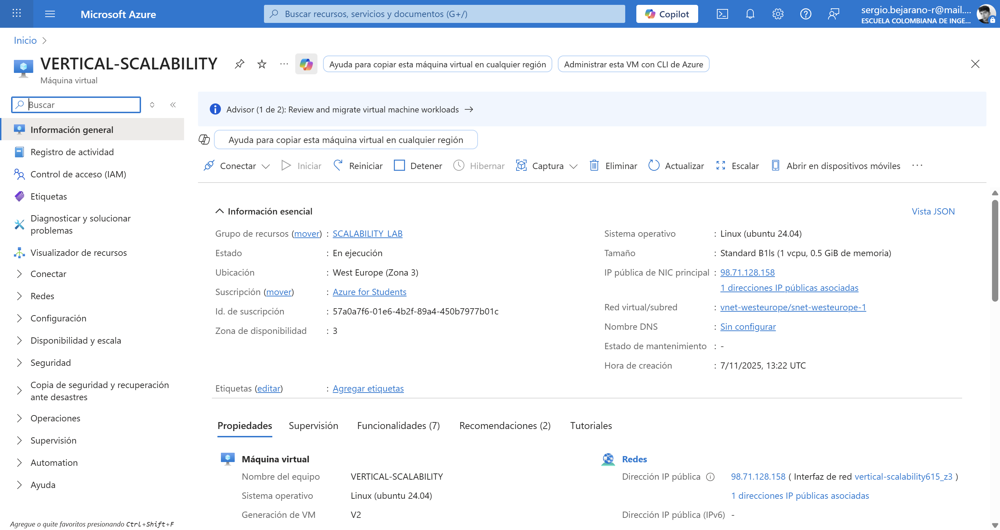

2. Para conectarse a la VM use el siguiente comando, donde las `x` las debe remplazar por la IP de su propia VM (Revise la sección "Connect" de la virtual machine creada para tener una guía más detallada).

   `ssh scalability_lab@xxx.xxx.xxx.xxx`

Con el siguiente comando se establece la conexión:

```sh
ssh -i VERTICAL-SCALABILITY_key.pem scalability_lab@98.71.128.158
```

3. Instale node, para ello siga la sección _Installing Node.js and npm using NVM_ que encontrará en este [enlace](https://linuxize.com/post/how-to-install-node-js-on-ubuntu-18.04/).

Realizamos las instalaciones con los siguientes comandos:

```sh
curl -o- https://raw.githubusercontent.com/nvm-sh/nvm/master/install.sh | bash
```

Luego:

```sh
export NVM_DIR="$HOME/.nvm"
[ -s "$NVM_DIR/nvm.sh" ] && \. "$NVM_DIR/nvm.sh"
```

Instalar la última versión:

```sh
nvm install --lts
```

Verificando versiones instaladas de node y npm:

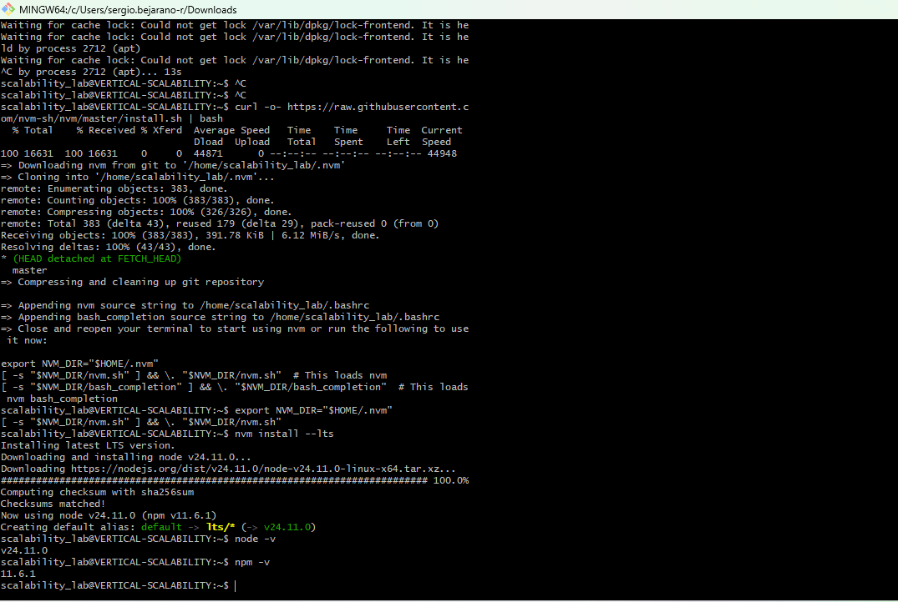

4. Para instalar la aplicación adjunta al Laboratorio, suba la carpeta `FibonacciApp` a un repositorio al cual tenga acceso y ejecute estos comandos dentro de la VM:

   `git clone <your_repo>`

   `cd <your_repo>/FibonacciApp`

   `npm install`

Se ejecutaron los siguientes comandos dentro de la maquina virtual:

```sh
 git clone https://github.com/SergioBejarano/FibonacciApp.git
 cd FibonacciApp
 npm install
```

Resultado:
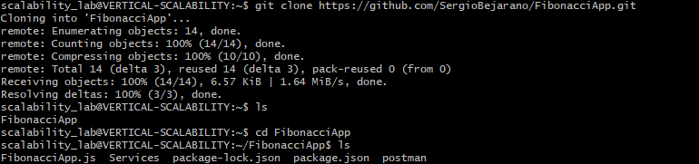

5. Para ejecutar la aplicación puede usar el comando `npm FibinacciApp.js`, sin embargo una vez pierda la conexión ssh la aplicación dejará de funcionar. Para evitar ese compartamiento usaremos _forever_. Ejecute los siguientes comando dentro de la VM.

   ` node FibonacciApp.js`

Ejecutamos:

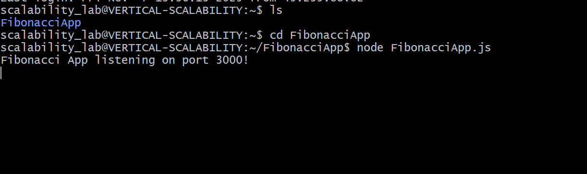

6. Antes de verificar si el endpoint funciona, en Azure vaya a la sección de _Networking_ y cree una _Inbound port rule_ tal como se muestra en la imágen. Para verificar que la aplicación funciona, use un browser y user el endpoint `http://xxx.xxx.xxx.xxx:3000/fibonacci/6`. La respuesta debe ser `The answer is 8`.


Creamos la regla de entrada:

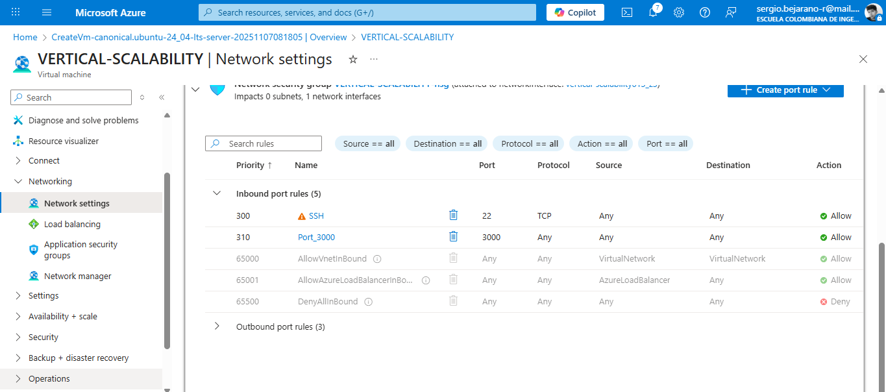

Haciendo la prueba:
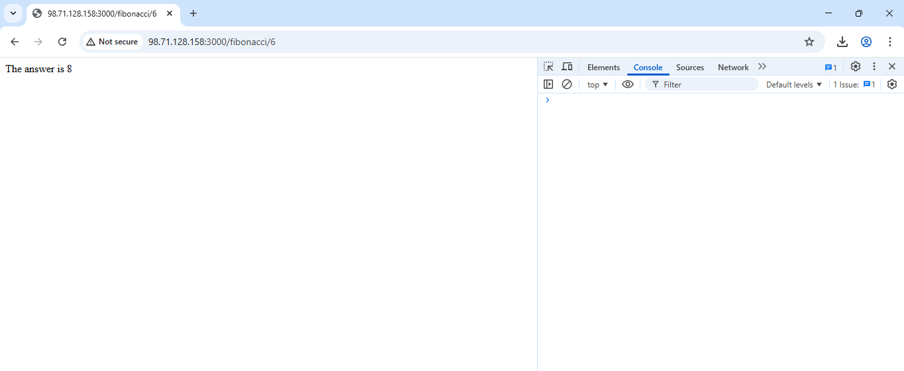

7. La función que calcula en enésimo número de la secuencia de Fibonacci está muy mal construido y consume bastante CPU para obtener la respuesta. Usando la consola del Browser documente los tiempos de respuesta para dicho endpoint usando los siguintes valores:

- Para 1000000:
  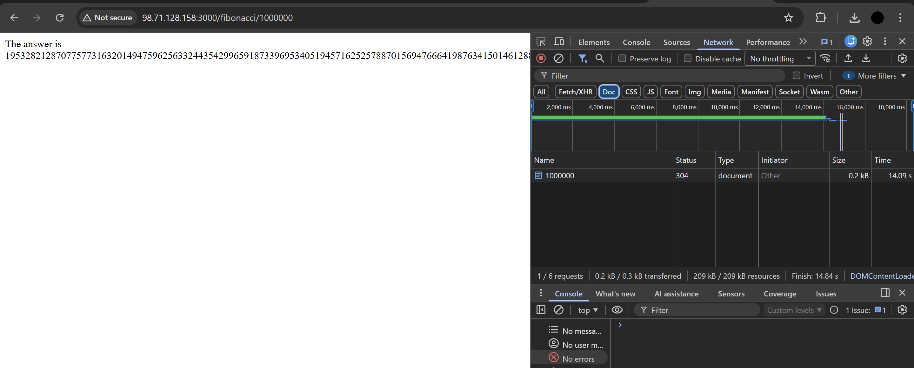

El tiempo fue de 14.09 s

- Para 1010000:
  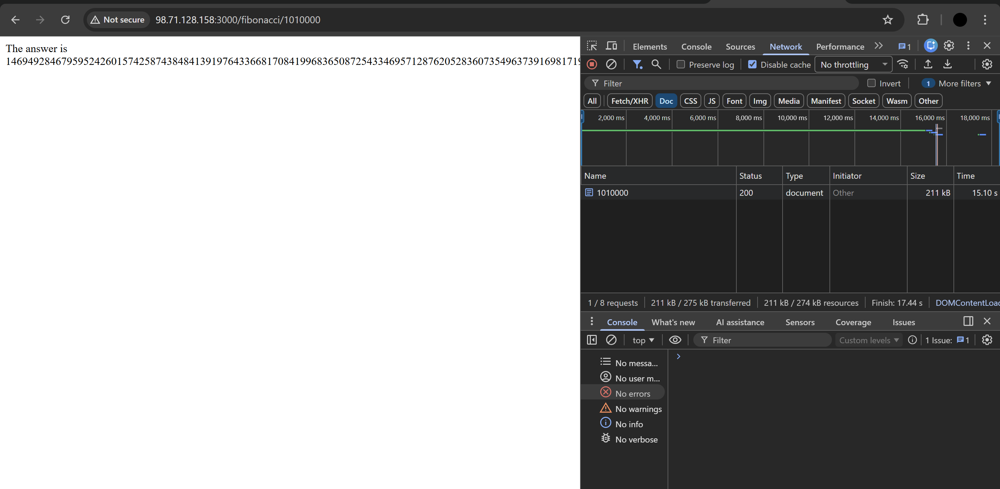

El tiempo fue de 15.10 s.

- Para 1020000:
  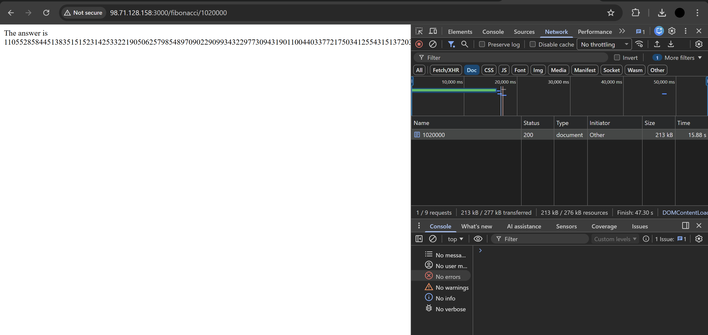

El tiempo fue de 15.88 s.

- Para 1030000:
  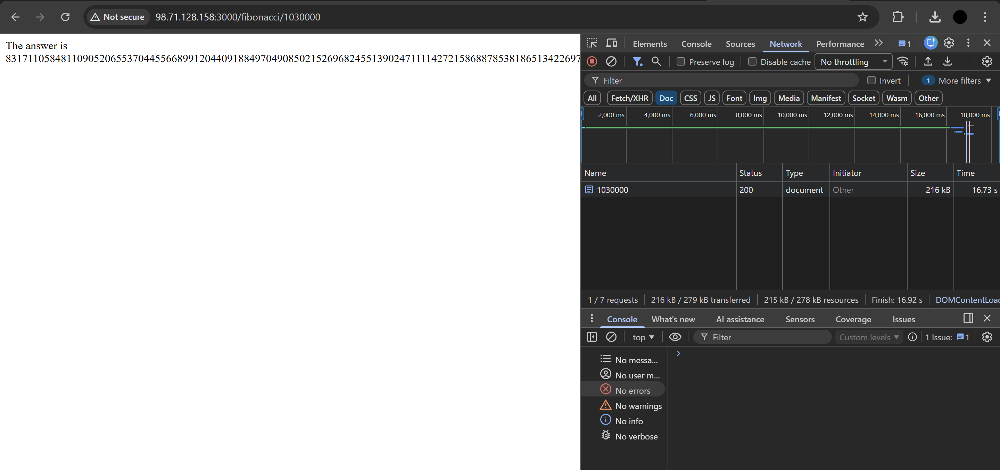

El tiempo fue de 16.73 s.

- Para 1040000:
  

El tiempo fue de 16.92 s.

- Para 1050000:
  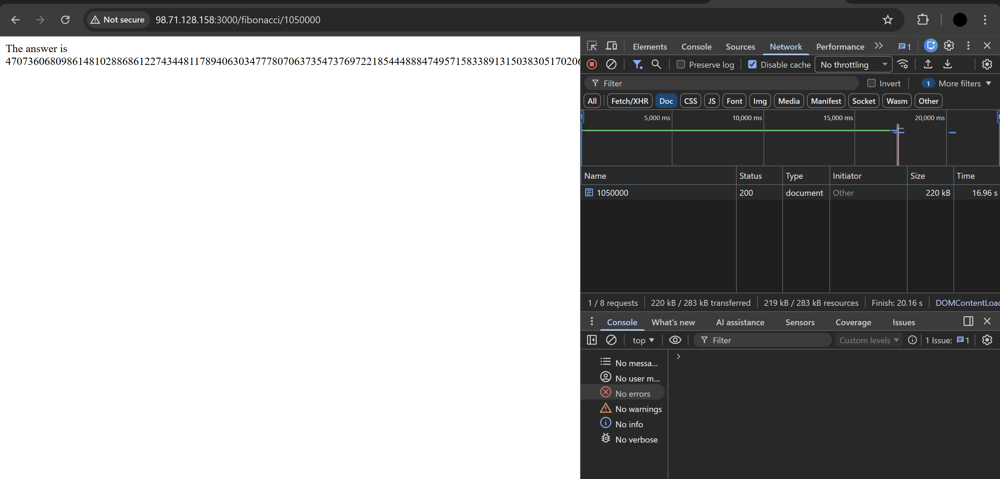

El tiempo fue de 16.96 s.

- Para 1060000:
  

El tiempo fue de 18.14 s.

- Para 1070000:
  

El tiempo fue de 18.89 s.

- Para 1080000:
  

El tiempo fue de 17.40 s.

- Para 1090000:  
  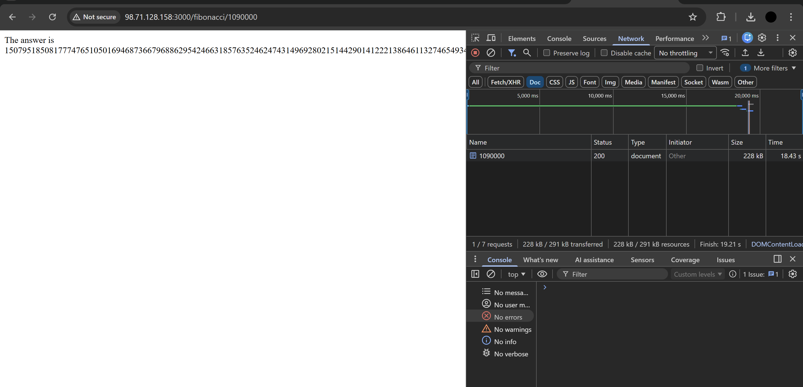

El tiempo fue de 18.43 s.

8. Dírijase ahora a Azure y verifique el consumo de CPU para la VM. (Los resultados pueden tardar 5 minutos en aparecer).


Vemos que hay un alto consumo de CPU:

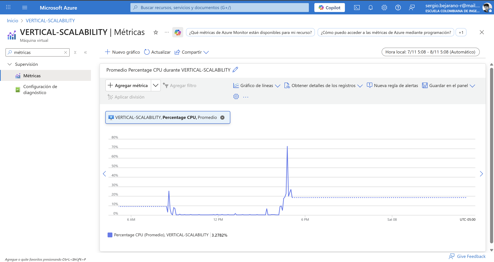

9. Ahora usaremos Postman para simular una carga concurrente a nuestro sistema. Siga estos pasos.

   - Instale newman con el comando `npm install newman -g`. Para conocer más de Newman consulte el siguiente [enlace](https://learning.getpostman.com/docs/postman/collection-runs/command-line-integration-with-newman/).
   - Diríjase hasta la ruta `FibonacciApp/postman` en una maquina diferente a la VM.
   - Para el archivo `[ARSW_LOAD-BALANCING_AZURE].postman_environment.json` cambie el valor del parámetro `VM1` para que coincida con la IP de su VM.
   - Ejecute el siguiente comando.

   ```
   newman run ARSW_LOAD-BALANCING_AZURE.postman_collection.json -e [ARSW_LOAD-BALANCING_AZURE].postman_environment.json -n 10 &
   newman run ARSW_LOAD-BALANCING_AZURE.postman_collection.json -e [ARSW_LOAD-BALANCING_AZURE].postman_environment.json -n 10
   ```

Vemos como se van completando las iteraciones:

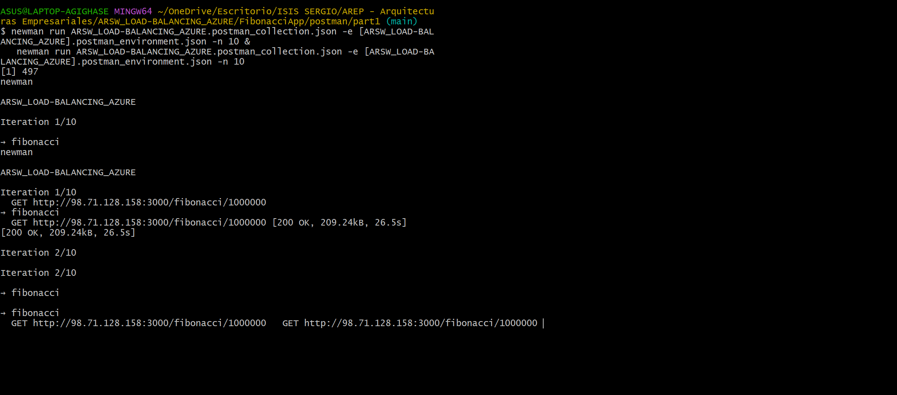

10. La cantidad de CPU consumida es bastante grande y un conjunto considerable de peticiones concurrentes pueden hacer fallar nuestro servicio. Para solucionarlo usaremos una estrategia de Escalamiento Vertical. En Azure diríjase a la sección _size_ y a continuación seleccione el tamaño `B2ms`.


Realizamos el cambio:

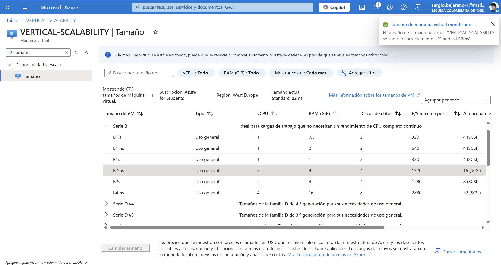

11. Una vez el cambio se vea reflejado, repita el paso 7, 8 y 9.

- Para 1000000:
  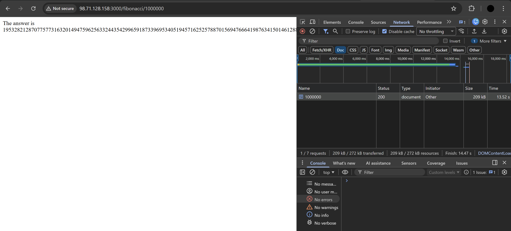

El tiempo fue de 13.52 s

- Para 1010000:
  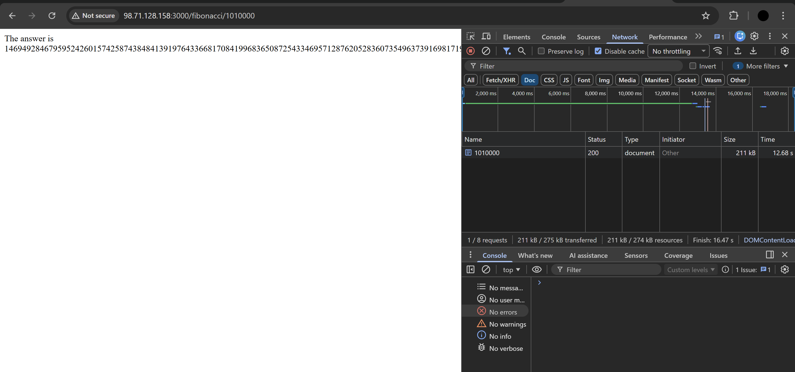

El tiempo fue de 12.68 s.

- Para 1020000:
  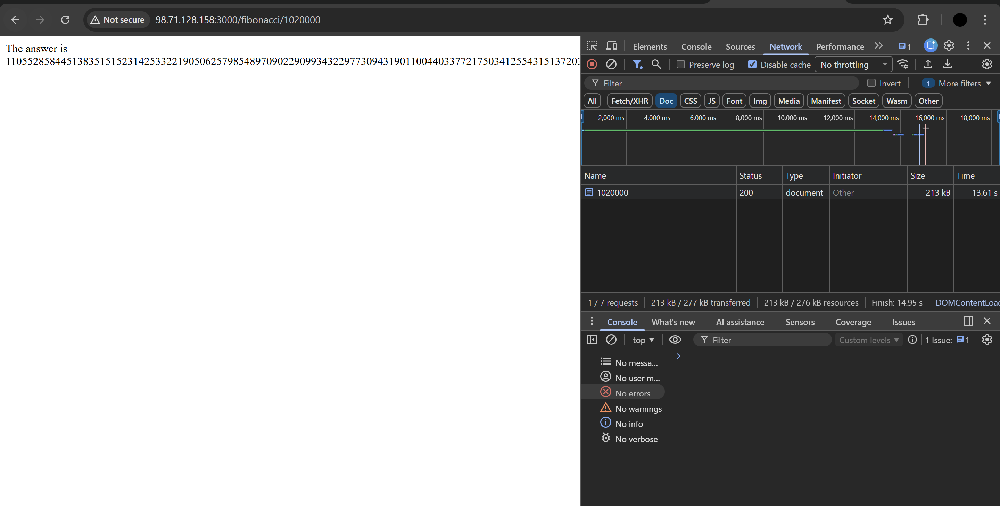

El tiempo fue de 13.61 s.

- Para 1030000:
  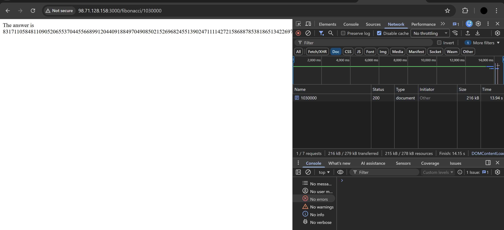

El tiempo fue de 13.94 s.

- Para 1040000:
  

El tiempo fue de 13.33 s.

- Para 1050000:
  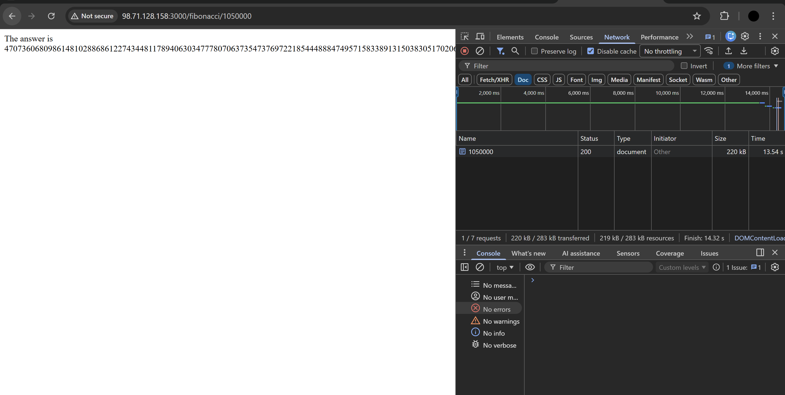

El tiempo fue de 13.54 s.

- Para 1060000:
  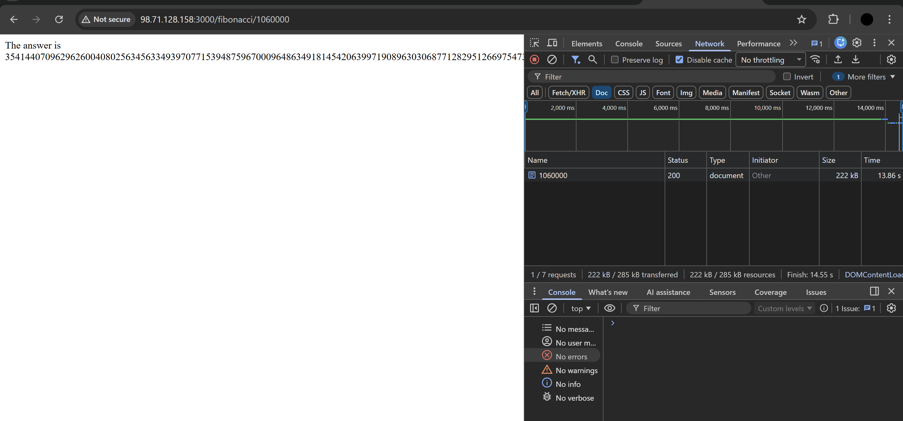

El tiempo fue de 13.86 s.

- Para 1070000:
  

El tiempo fue de 13.90 s.

- Para 1080000:
  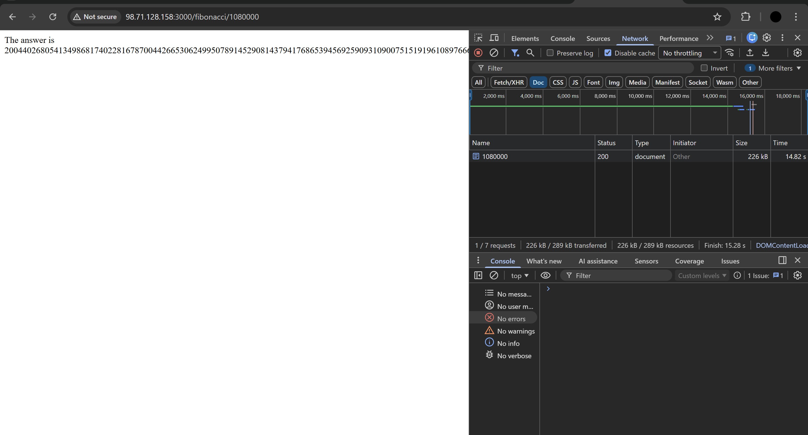

El tiempo fue de 14.82 s.

- Para 1090000:  
  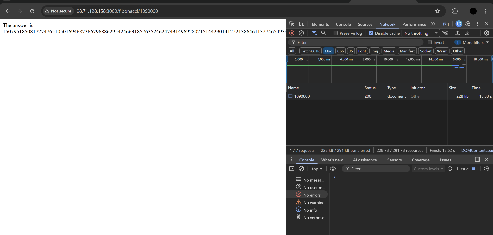

El tiempo fue de 15.33 s.

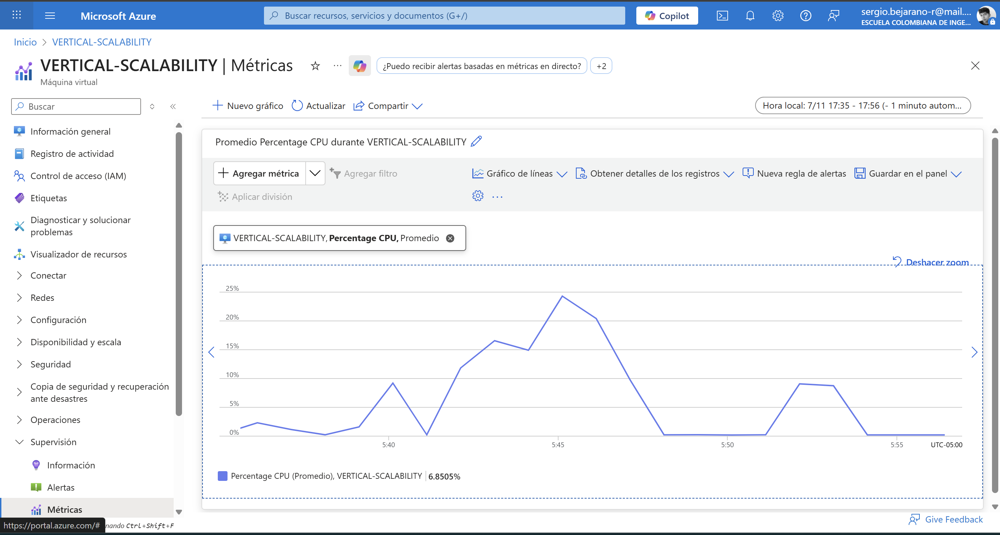
Vemos en la imagen que el pico más alto fue de 25% en comparación antes con B1ls que el pico más alto fue de 68%.

En la siguiente imagen ya se obtienen resultados positivos, el tiempo promedio para responder fue de 12.1 segundos a comparación de cuando se tenía un tamaño de B1ls:

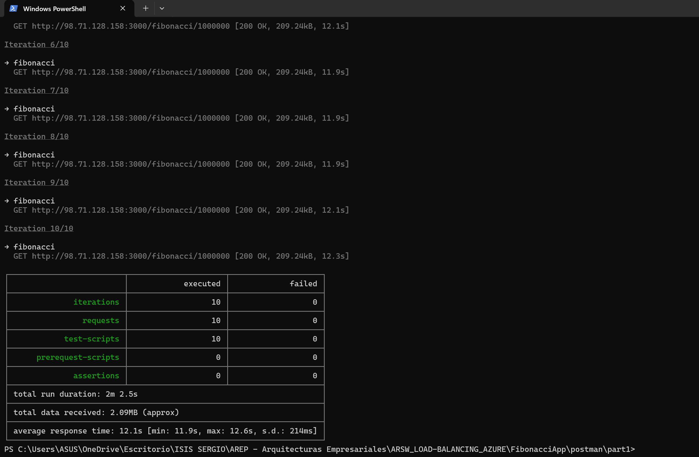

12. Evalue el escenario de calidad asociado al requerimiento no funcional de escalabilidad y concluya si usando este modelo de escalabilidad logramos cumplirlo.

Los tiempos después del escalamiento son consistentemente menores y más estables.
Eso sugiere que el modelo de escalabilidad:

Distribuyó mejor la carga de trabajo (probablemente entre varias núcleos).

Redujo los cuellos de botella de CPU, especialmente para valores grandes de n.

Mejoró la capacidad de respuesta del sistema bajo demanda creciente.

Además, no aparecen errores de conexión (ECONNRESET), lo cual indica mayor estabilidad del servicio bajo carga.

13. Vuelva a dejar la VM en el tamaño inicial para evitar cobros adicionales.

**Preguntas**

1. ¿Cuántos y cuáles recursos crea Azure junto con la VM?

Los recursos mostrados en la siguiente imagen son los que crea Azure:

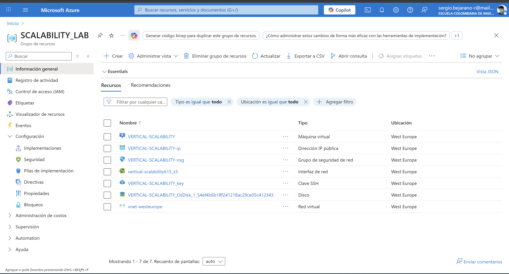

2. ¿Brevemente describa para qué sirve cada recurso?

Al crear la máquina virtual VERTICAL-SCALABILITY en Azure, el sistema aprovisiona automáticamente todos los componentes necesarios para garantizar su operación, conectividad y seguridad dentro de la nube. La VM (VERTICAL-SCALABILITY) es el servidor donde se ejecuta el sistema operativo y las aplicaciones del usuario; para que pueda ser accesible desde Internet, se asigna una dirección IP pública (VERTICAL-SCALABILITY-ip), mientras que el tráfico entrante y saliente se controla mediante el grupo de seguridad de red (VERTICAL-SCALABILITY-nsg), que actúa como firewall. La comunicación de la máquina con la red se habilita a través de la interfaz de red o NIC (vertical-scalability615_z3), que se conecta a la red virtual (vnet-westeurope), la cual proporciona un entorno privado y segmentado para el tráfico interno. Además, la autenticación segura para ingresar a la VM se gestiona mediante el par de claves SSH (VERTICAL-SCALABILITY_key), evitando contraseñas vulnerables; y el almacenamiento del sistema operativo se encuentra en el disco OS (VERTICAL-SCALABILITY_OsDisk…), donde residen los archivos esenciales para su ejecución. Todos estos recursos trabajan en conjunto para ofrecer una infraestructura completa, operativa y protegida desde el momento del despliegue.

3. ¿Al cerrar la conexión ssh con la VM, por qué se cae la aplicación que ejecutamos con el comando `npm FibonacciApp.js`? ¿Por qué debemos crear un _Inbound port rule_ antes de acceder al servicio?

Al cerrar la conexión SSH, la aplicación se detiene porque se está ejecutando directamente dentro de la sesión remota; al finalizar esa sesión, todos los procesos asociados a ella también se cierran, lo que provoca que el servicio deje de funcionar. Además, es necesario crear una Inbound port rule en el Grupo de Seguridad de Red para permitir el acceso externo, ya que de manera predeterminada Azure bloquea el tráfico entrante hacia la máquina virtual y solo mediante esta regla se autoriza que los usuarios se conecten al puerto en el que la aplicación está escuchando.

4. Adjunte tabla de tiempos e interprete por qué la función tarda tando tiempo.

| Valor probado | Tiempo Antes (s) | Tiempo Después (s) |
| ------------- | ---------------- | ------------------ |
| 1,000,000     | 14.09            | 13.52              |
| 1,010,000     | 15.10            | 12.68              |
| 1,020,000     | 15.88            | 13.61              |
| 1,030,000     | 16.73            | 13.94              |
| 1,040,000     | 16.92            | 13.33              |
| 1,050,000     | 16.96            | 13.54              |
| 1,060,000     | 18.14            | 13.86              |
| 1,070,000     | 18.89            | 13.90              |
| 1,080,000     | 17.40            | 14.82              |
| 1,090,000     | 18.43            | 15.33              |

La función tarda tanto tiempo porque el cálculo del número de Fibonacci que está realizando es computacionalmente costoso y no está optimizado. En cada ejecución se solicita un valor muy alto (cerca de 1’000.000), y si el algoritmo implementado usa un método iterativo o recursivo incremental, requiere recorrer prácticamente todos los números anteriores hasta llegar al resultado, consumiendo gran cantidad de CPU y memoria. Además, el proceso se ejecuta en un solo hilo sin paralelización, por lo que la carga recae totalmente en un núcleo de la máquina virtual, provocando que el tiempo aumente significativamente conforme crece el valor solicitado, generando una tendencia casi lineal en el incremento del tiempo de ejecución.

5. Adjunte imágen del consumo de CPU de la VM e interprete por qué la función consume esa cantidad de CPU.

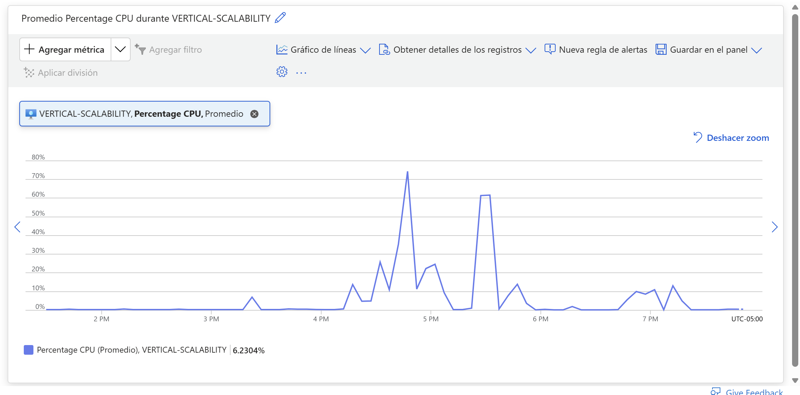

La función es lenta porque para obtener el n-ésimo número de Fibonacci utiliza un algoritmo iterativo lineal, es decir, necesita realizar un ciclo con casi un millón de iteraciones para los valores probados. En cada iteración, además del cálculo matemático, se realizan operaciones con big integers mediante la librería big-integer, lo que implica manejar números extremadamente grandes que requieren más tiempo y memoria para ser procesados en cada suma. Al ejecutarse en un solo hilo y sin ningún tipo de memoización, paralelización o aproximación matemática, el tiempo de ejecución crece proporcionalmente al valor de entrada. Por esto, al incrementar el valor solicitado (1,000,000 → 1,090,000), el tiempo aumenta gradualmente debido a la mayor cantidad de operaciones necesarias para llegar al resultado.

6. Adjunte la imagen del resumen de la ejecución de Postman. Interprete:
   - Tiempos de ejecución de cada petición.
   - Si hubo fallos documentelos y explique.


En la ejecución de las pruebas en Postman se realizaron 10 peticiones al servicio, todas ejecutadas correctamente sin fallos ni errores durante el proceso. El tiempo promedio de respuesta fue de 12.1 segundos, con un mínimo de 11.9 s y un máximo de 12.6 s, lo que refleja un comportamiento estable y consistente del servicio, teniendo una desviación estándar baja (214 ms). El tiempo total de la ejecución fue de 2 minutos y 2.5 segundos, recibiéndose aproximadamente 2.09 MB de datos, lo que indica que el procesamiento del número de Fibonacci solicitado es computacionalmente intensivo, pero el sistema logra responder de manera uniforme en cada iteración. Dado que el número de peticiones fallidas fue cero, se puede concluir que el servicio es funcional y fiable bajo esta carga.

7. ¿Cuál es la diferencia entre los tamaños `B2ms` y `B1ls` (no solo busque especificaciones de infraestructura)?

La diferencia entre los tamaños B2ms y B1ls no es solo de hardware, sino también de capacidad de procesamiento, desempeño y casos de uso:

| Característica           | B1ls                                   | B2ms                                        |
| ------------------------ | -------------------------------------- | ------------------------------------------- |
| vCPU                     | 1 vCPU básico                          | 2 vCPU con mayor rendimiento                |
| Memoria RAM              | 0.5 GB                                 | 8 GB                                        |
| Desempeño                | Muy limitado, solo tareas ligeras      | Adecuado para cálculos y cargas moderadas   |
| Rendimiento sostenido    | Bajo, puede bajar si se exige          | Alto y estable bajo carga continua          |
| Casos de uso             | Pruebas simples, automatización ligera | APIs, servicios con procesamiento intensivo |
| Relación costo–beneficio | Muy económico                          | Mayor costo pero también mejor desempeño    |

8. ¿Aumentar el tamaño de la VM es una buena solución en este escenario?, ¿Qué pasa con la FibonacciApp cuando cambiamos el tamaño de la VM?

Aumentar el tamaño de la VM es una solución válida solo a corto plazo, ya que asignar más CPU y memoria mejora el rendimiento de la aplicación y reduce los tiempos de respuesta, como se evidenció al cambiar de B1ls a B2ms, donde la FibonacciApp logró procesar valores más altos de la secuencia en menor tiempo y de manera más estable. Sin embargo, esta mejora depende únicamente de incrementar recursos y no de optimizar el algoritmo; por lo tanto, si la aplicación sigue creciendo en demanda o si el cálculo continúa aumentando su complejidad, la estrategia de escalar verticalmente tendrá un límite físico y económico, haciendo que esta solución deje de ser eficiente. En conclusión, el cambio de tamaño de la VM acelera la FibonacciApp, pero no resuelve el problema de fondo: la aplicación continúa siendo monolítica y altamente dependiente del procesamiento individual de la VM, por lo que será necesario considerar soluciones de optimización del código y escalabilidad horizontal en el futuro.

9. ¿Qué pasa con la infraestructura cuando cambia el tamaño de la VM? ¿Qué efectos negativos implica?

Al cambiar el tamaño de la VM, Azure debe reasignar recursos físicos en el clúster donde está alojada, lo que implica detener temporalmente la máquina virtual durante el proceso. Esto puede generar interrupciones en el servicio, pérdida de sesiones activas y riesgo de indisponibilidad si no se gestiona correctamente. Además, aumentar el tamaño implica un mayor costo operativo, y aunque se obtienen más recursos, esta solución tiene un límite físico: llega un punto en el que no es posible continuar escalando verticalmente sin afectar la eficiencia económica o exceder la capacidad disponible en la región.

10. ¿Hubo mejora en el consumo de CPU o en los tiempos de respuesta? Si/No ¿Por qué?

Sí, hubo una mejora en los tiempos de respuesta, ya que la VM con mayor capacidad (B2ms) dispone de más vCPUs y memoria, lo cual permite ejecutar el cálculo de Fibonacci de forma más rápida y sostenida. Aunque el consumo de CPU sigue siendo alto debido a la naturaleza intensiva del cálculo, ahora la VM es capaz de soportar la carga sin saturarse tan rápido como en el tamaño anterior. En resumen, el rendimiento mejora, pero el algoritmo continúa siendo computacionalmente costoso, por lo que la optimización del código sigue siendo necesaria a largo plazo

11. Aumente la cantidad de ejecuciones paralelas del comando de postman a `4`. ¿El comportamiento del sistema es porcentualmente mejor?

Tabla 1:
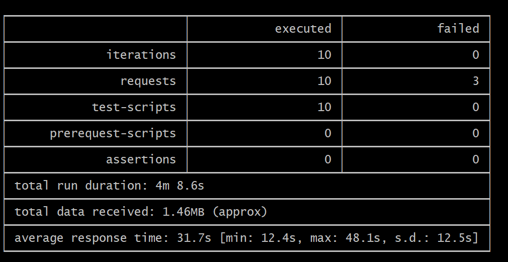

Tabla 2:
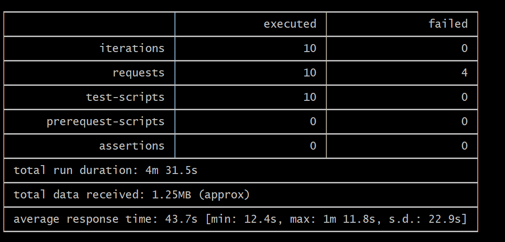

Tabla 3:
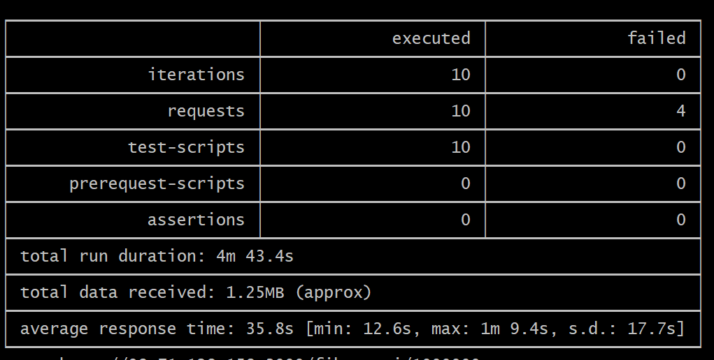

Tabla 4:


Las solicitudes que fallaron fueron por el siguiente tipo de error:


El error ECONNRESET aparece debido a que la VM se sobrecarga con las múltiples solicitudes paralelas de cálculo del número de Fibonacci, un proceso altamente demandante de CPU. Cuando el servidor no logra completar la respuesta porque está ocupado procesando operaciones intensivas o su capacidad es insuficiente, la conexión se interrumpe abruptamente y Node.js cierra el socket de comunicación, lo que provoca que el cliente (Newman/Postman) reciba este error. En otras palabras, la aplicación continúa recibiendo peticiones aun cuando no puede seguir procesándolas, saturando el servidor hasta el punto en que este deja de responder adecuadamente y rompe las conexiones activas de forma inesperada.


Al aumentar la cantidad de ejecuciones paralelas a 4, el sistema no mejora porcentualmente su desempeño; por el contrario, el tiempo promedio de respuesta tiende a empeorar. Esto ocurre debido a que la FibonacciApp realiza un cálculo altamente demandante de CPU y se ejecuta de manera totalmente síncrona y monohilo, por lo que cada petición adicional compite directamente por los mismos recursos del procesador. Como consecuencia, cuando se envían múltiples solicitudes simultáneas, la VM debe repartir su capacidad entre todas ellas, provocando mayor tiempo de espera por contexto y mayor ocupación del CPU, lo que afecta el rendimiento global.

En conclusión, el sistema no escala eficientemente en paralelo, ya que su rendimiento está limitado por un único proceso de cómputo intensivo ejecutándose en la misma VM, sin distribución de carga ni paralelización interna del algoritmo.

### Parte 2 - Escalabilidad horizontal

#### Crear el Balanceador de Carga

Antes de continuar puede eliminar el grupo de recursos anterior para evitar gastos adicionales y realizar la actividad en un grupo de recursos totalmente limpio.

1. El Balanceador de Carga es un recurso fundamental para habilitar la escalabilidad horizontal de nuestro sistema, por eso en este paso cree un balanceador de carga dentro de Azure tal cual como se muestra en la imágen adjunta.


Creamos el balanceador de carga, asignando el grupo de recursos y las características dadas

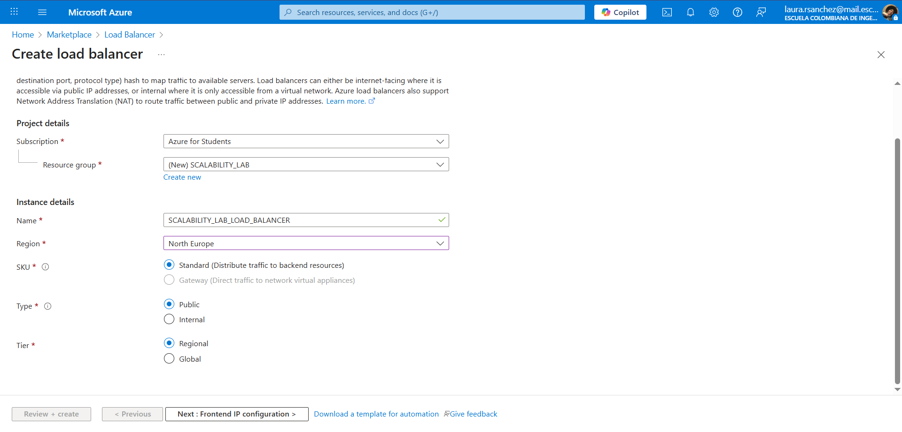

Creamos una IP

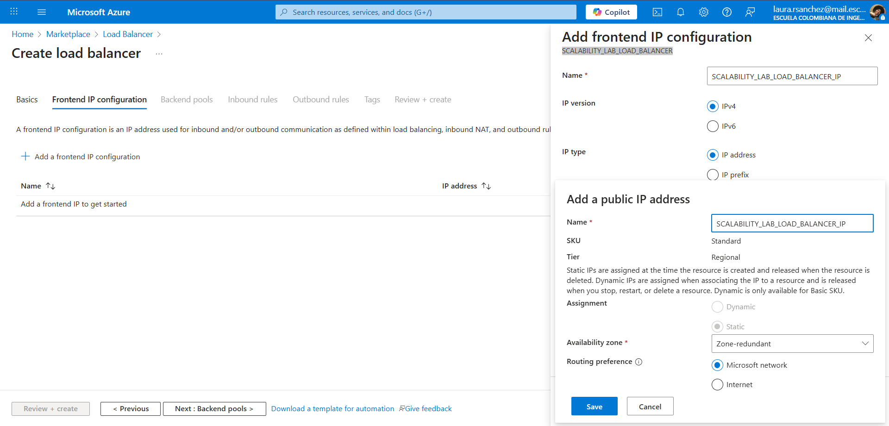

2. A continuación cree un _Backend Pool_, guiese con la siguiente imágen.


Creamos un backend pool en nuestro balanceador de cargas

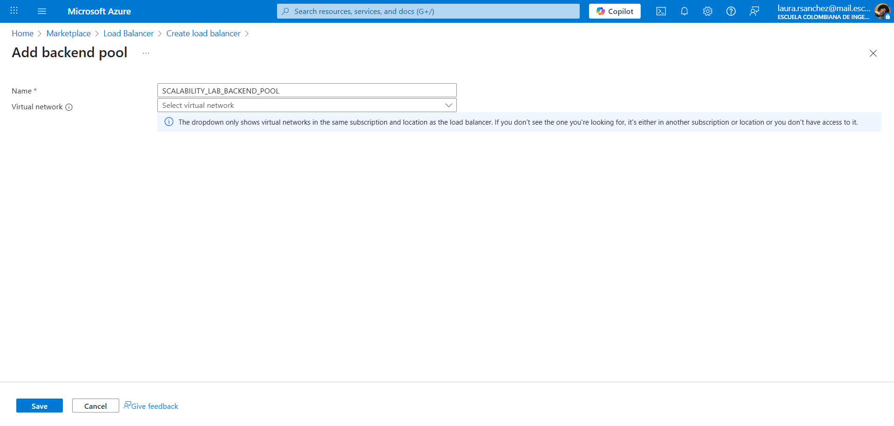

Verificamos que se haya creado y asignado correctamente

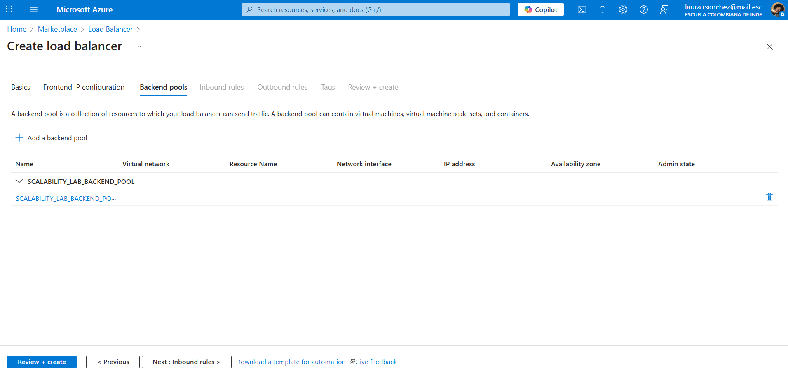

3. A continuación cree un _Health Probe_, guiese con la siguiente imágen.


Creamos nuestro Health Probe

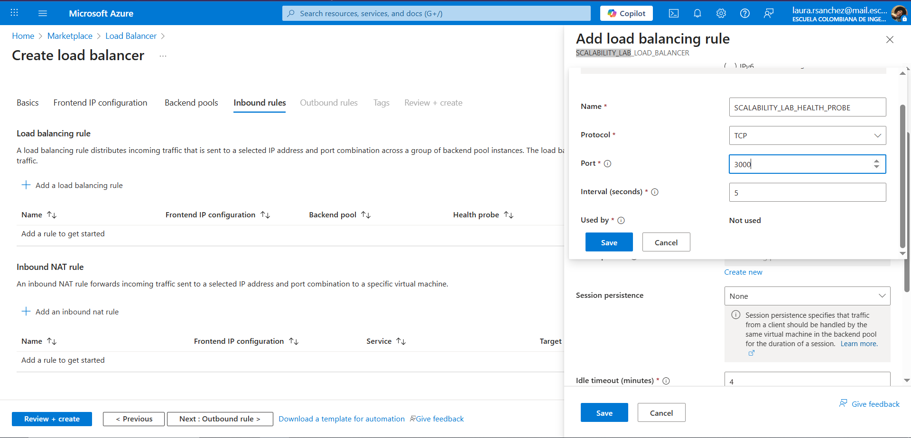

4. A continuación cree un _Load Balancing Rule_, guiese con la siguiente imágen.


Creamos un Load Balancing Rule con las características dadas y el Health Probe y Backend Pool anteriormente creados

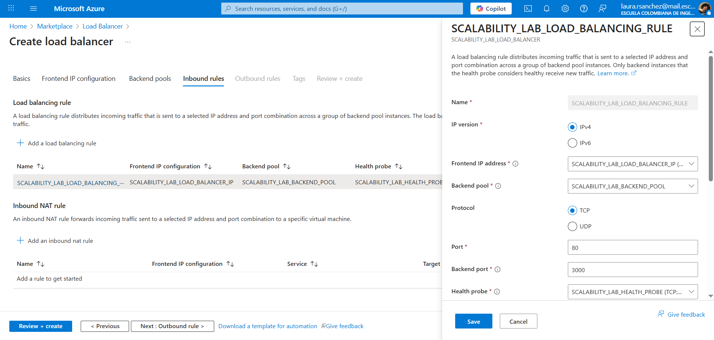

Verificamos que todo se encuentre correctamente configurado

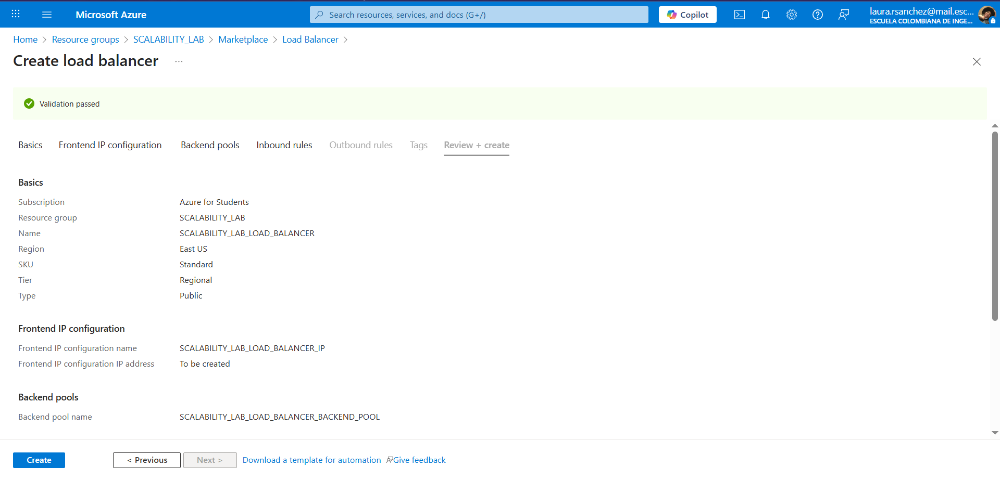

Creamos

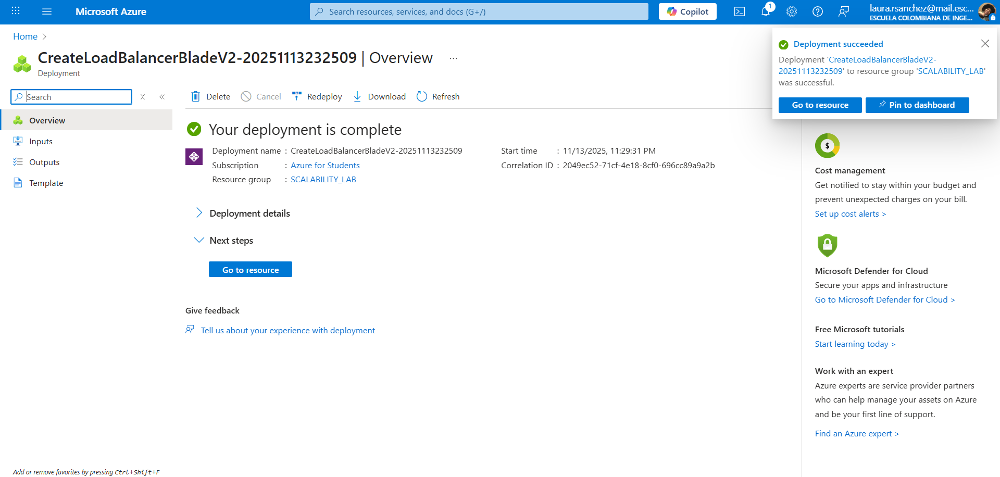

5. Cree una _Virtual Network_ dentro del grupo de recursos, guiese con la siguiente imágen.


Creamos una virtual network con las características dadas

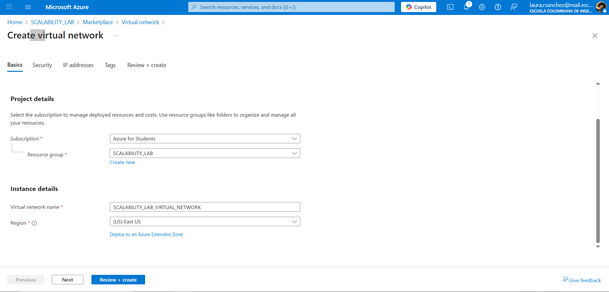


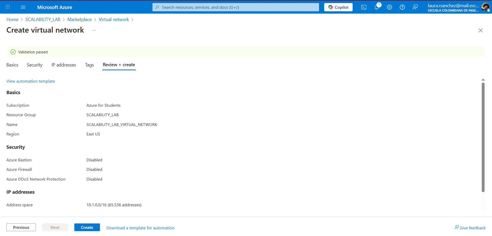

Vamos al recurso y comprobamos que se creó correctamente

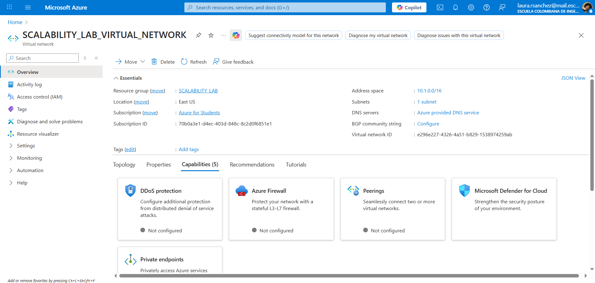

#### Crear las maquinas virtuales (Nodos)

Ahora vamos a crear 3 VMs (VM1, VM2 y VM3) con direcciones IP públicas standar en 3 diferentes zonas de disponibilidad. Después las agregaremos al balanceador de carga.

1. En la configuración básica de la VM guíese por la siguiente imágen. Es importante que se fije en la "Avaiability Zone", donde la VM1 será 1, la VM2 será 2 y la VM3 será 3.


Creamos las 3 máquinas virtuales VM1, VM2 y VM3 con la configuración dada

- VM1
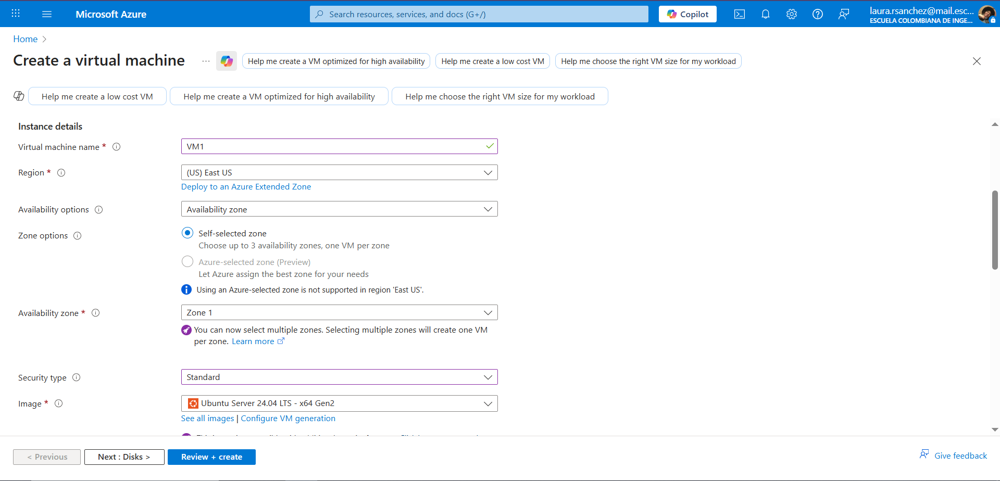


- VM2
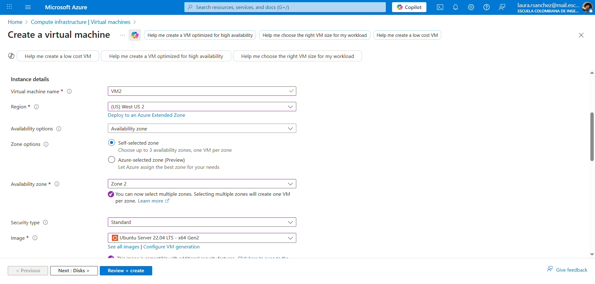


- VM3
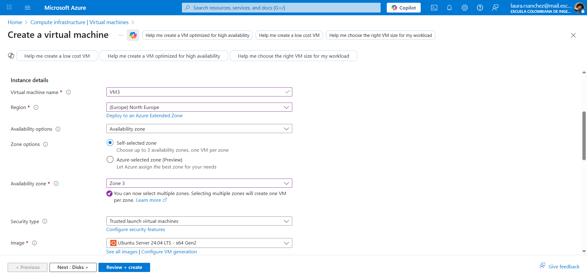

**Al realizar la configuración de la virtual network fue evidente que no se podia crear en zonas distintas de la misma región, y al cambiar la región se perdía la virtual network**

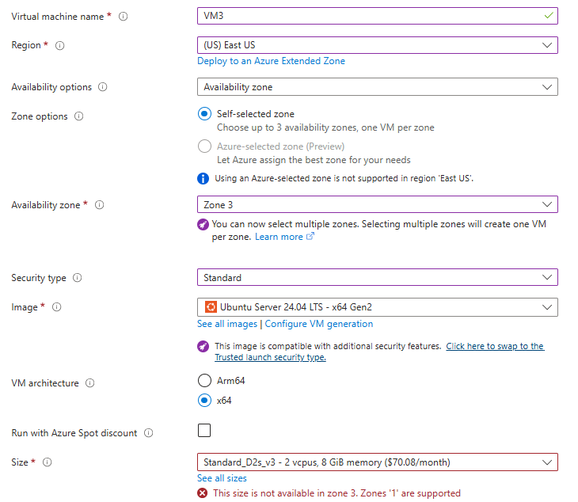

2. En la configuración de networking, verifique que se ha seleccionado la _Virtual Network_ y la _Subnet_ creadas anteriormente. Adicionalmente asigne una IP pública y no olvide habilitar la redundancia de zona.


Verificamos que se ha seleccionado la Virtual Network y la Subnet creadas anteriormente. Adicionalmente asignamos una IP pública y habilitamos la redundancia de zona.

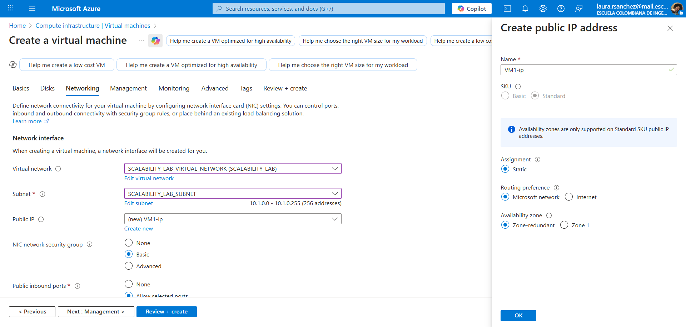

Repetimos el proceso con las otras dos máquinas virtuales
**En este paso no fue posible crear la tercera máquina virtual, ya que por el tipo de suscripción solo es posible tener 3 IP, las cuales se encuentran ya ocupadas por el balanceador de cargas y las otras dos maquinas virtuales**

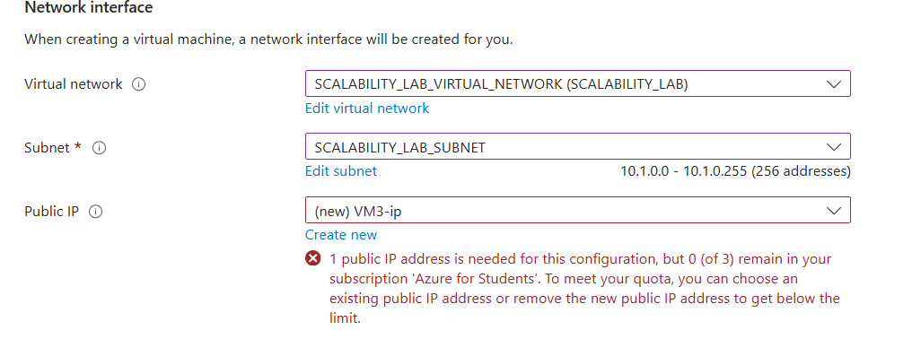

3. Para el Network Security Group seleccione "avanzado" y realice la siguiente configuración. No olvide crear un _Inbound Rule_, en el cual habilite el tráfico por el puerto 3000. Cuando cree la VM2 y la VM3, no necesita volver a crear el _Network Security Group_, sino que puede seleccionar el anteriormente creado.


Seleccionamos avanzado y creamos el siguiente network security group


Verificamos que se asignó el nuevo grupo de seguridad, en las otras máquinas asignamos este grupo
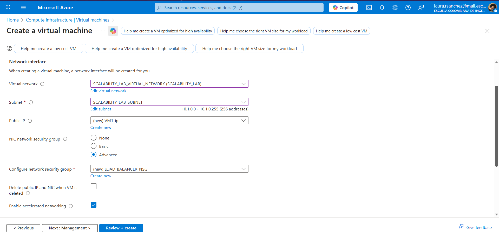

4. Ahora asignaremos esta VM a nuestro balanceador de carga, para ello siga la configuración de la siguiente imágen.


Asignamos nuestro balanceador de carga creado anteriormente, repetimos en las otras dos máquinas

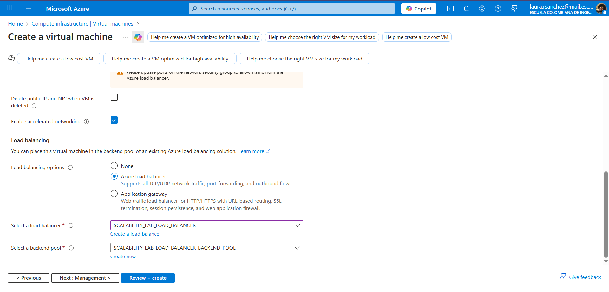

5. Finalmente debemos instalar la aplicación de Fibonacci en la VM. para ello puede ejecutar el conjunto de los siguientes comandos, cambiando el nombre de la VM por el correcto

```
git clone https://github.com/daprieto1/ARSW_LOAD-BALANCING_AZURE.git

curl -o- https://raw.githubusercontent.com/creationix/nvm/v0.34.0/install.sh | bash
source /home/vm1/.bashrc
nvm install node

cd ARSW_LOAD-BALANCING_AZURE/FibonacciApp
npm install

npm install forever -g
forever start FibonacciApp.js
```

Creamos la máquina y verificamos que la implementación se haya realizado correctamente

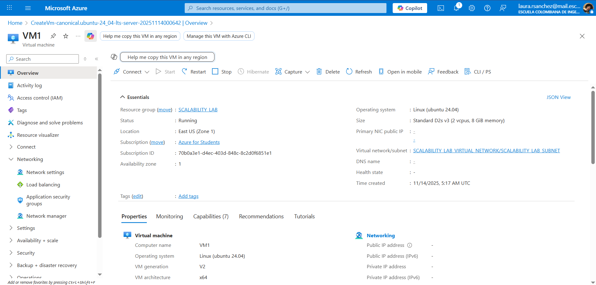

Nos conectamos a la máquina y ejecutamos los comandos

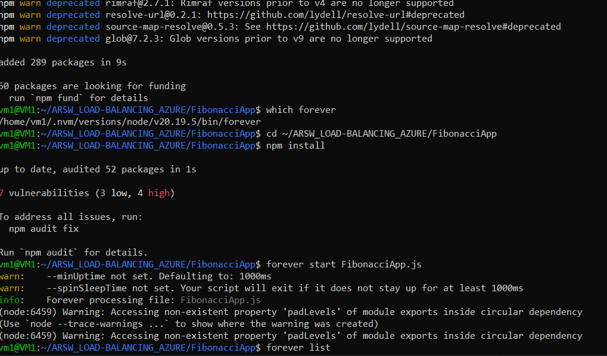

#### Probar el resultado final de nuestra infraestructura

1. Por supuesto el endpoint de acceso a nuestro sistema será la IP pública del balanceador de carga, primero verifiquemos que los servicios básicos están funcionando, consuma los siguientes recursos:

```
http://52.155.223.248/
http://52.155.223.248/fibonacci/1
```
`http://74.179.223.116/`

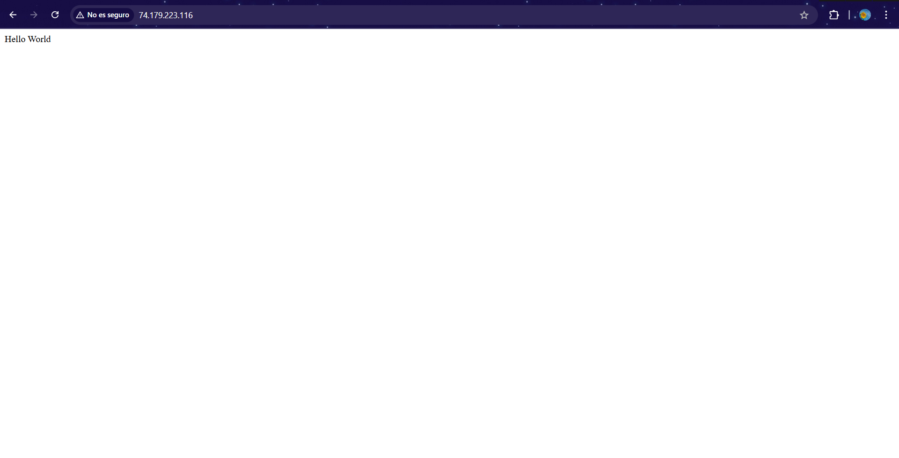

`http://74.179.223.116/fibonacci/1`

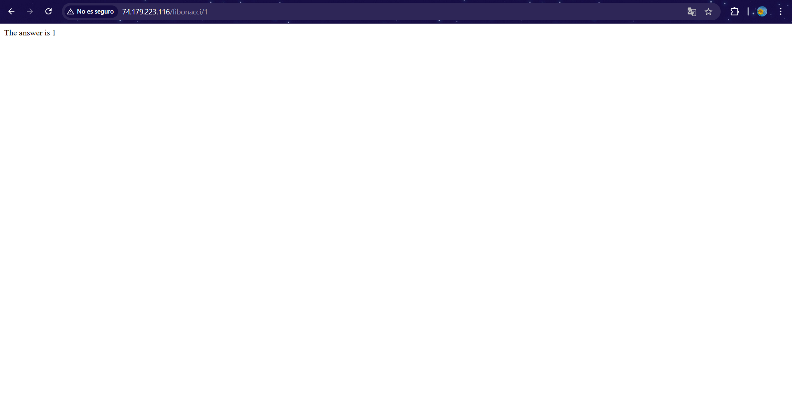

2. Realice las pruebas de carga con `newman` que se realizaron en la parte 1 y haga un informe comparativo donde contraste: tiempos de respuesta, cantidad de peticiones respondidas con éxito, costos de las 2 infraestrucruras, es decir, la que desarrollamos con balanceo de carga horizontal y la que se hizo con una maquina virtual escalada.

Se realizó las pruebas de carga y se obtuvieron:

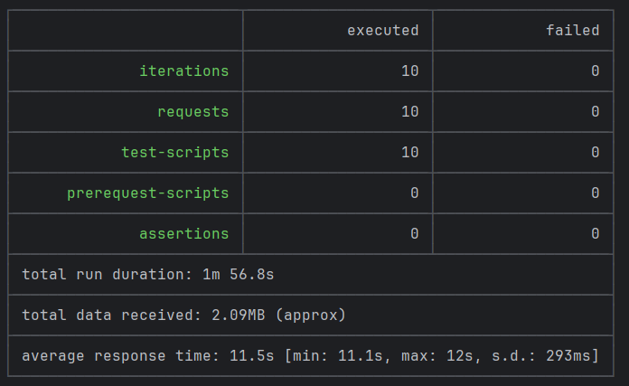

Se realizó el informe de comparación (archivo `Informe_VerticalVSHorizontal1`)

3. Agregue una 4 maquina virtual y realice las pruebas de newman, pero esta vez no lance 2 peticiones en paralelo, sino que incrementelo a 4. Haga un informe donde presente el comportamiento de la CPU de las 4 VM y explique porque la tasa de éxito de las peticiones aumento con este estilo de escalabilidad.

```
newman run ARSW_LOAD-BALANCING_AZURE.postman_collection.json -e [ARSW_LOAD-BALANCING_AZURE].postman_environment.json -n 10 &
newman run ARSW_LOAD-BALANCING_AZURE.postman_collection.json -e [ARSW_LOAD-BALANCING_AZURE].postman_environment.json -n 10 &
newman run ARSW_LOAD-BALANCING_AZURE.postman_collection.json -e [ARSW_LOAD-BALANCING_AZURE].postman_environment.json -n 10 &
newman run ARSW_LOAD-BALANCING_AZURE.postman_collection.json -e [ARSW_LOAD-BALANCING_AZURE].postman_environment.json -n 10
```

Al no ser posible crear más maquinas virtuales (Por el poblema presentado con el tipo de suscripción indicado con anterioridad) únicamente se realiza un breve informe detallando el comportamiento de la CPU de las VM

Se realizó el informe sobre el comportamiento de las CPU (archivo `Informe_CPU`)


**Preguntas**

- ¿Cuáles son los tipos de balanceadores de carga en Azure y en qué se diferencian?,

  En Azure hay dos tipos principales: el Load Balancer y el Application Gateway. El Load Balancer trabaja en la capa 4 (transporte), entonces básicamente distribuye el tráfico según la IP y el puerto, sin importarle qué tipo de aplicación está corriendo. Es más genérico y funciona con cualquier protocolo TCP/UDP. Por otro lado, el Application Gateway opera en la capa 7 (aplicación), lo que significa que puede tomar decisiones más inteligentes basándose en el contenido HTTP/HTTPS, como rutear según la URL o el hostname. Este último es ideal para aplicaciones web porque puede hacer cosas como SSL termination y tiene un WAF integrado.


- ¿Qué es SKU, qué tipos hay y en qué se diferencian?

  SKU significa "Stock Keeping Unit", pero básicamente es el tier o nivel del servicio que estás usando. En Load Balancer hay dos SKUs: Basic y Standard. El Basic es gratis pero tiene limitaciones importantes: solo soporta hasta 300 instancias, no tiene garantía de SLA y no funciona con Availability Zones. El Standard es de pago pero es mucho más robusto: soporta hasta 1000 instancias, tiene un SLA del 99.99%, funciona con zonas de disponibilidad y tiene mejores métricas y diagnósticos. Para producción casi siempre se usa Standard porque es más confiable.


- ¿Por qué el balanceador de carga necesita una IP pública?

  La IP pública es necesaria cuando quieres que tu aplicación sea accesible desde internet. Es básicamente la dirección que los usuarios van a usar para llegar a tu servicio. El balanceador recibe las peticiones en esa IP pública y luego las distribuye internamente a las VMs del backend que tienen IPs privadas. Si solo necesitas balanceo interno entre servicios que ya están en Azure, ahí sí puedes usar un Internal Load Balancer que solo tiene IP privada.


- ¿Cuál es el propósito del _Backend Pool_?

  El Backend Pool es simplemente el conjunto de máquinas virtuales o instancias que van a recibir el tráfico distribuido por el balanceador. Es como decirle al Load Balancer: "mira, estas son las VMs disponibles para atender peticiones". Puedes agregar o quitar instancias del pool dinámicamente, lo cual es super útil cuando haces auto-scaling. El balanceador solo envía tráfico a las instancias que están en este pool y que estén saludables según el health probe.


- ¿Cuál es el propósito del _Health Probe_?

  El Health Probe es el mecanismo que usa el balanceador para verificar que las instancias del backend pool estén funcionando correctamente. Básicamente hace peticiones periódicas (cada ciertos segundos) a un endpoint específico de tu aplicación. Si una VM no responde o responde con error varias veces seguidas, el balanceador la marca como "unhealthy" y deja de enviarle tráfico hasta que se recupere. Es super importante porque evita que los usuarios lleguen a servidores caídos o con problemas.


- ¿Cuál es el propósito de la _Load Balancing Rule_?¿Qué tipos de sesión persistente existen, por qué esto es importante y cómo puede afectar la escalabilidad del sistema?.

  La Load Balancing Rule define cómo se va a distribuir el tráfico: desde qué puerto público, hacia qué puerto del backend, usando qué protocolo, y con qué algoritmo de distribución. También aquí configuras la persistencia de sesión. Hay tres tipos: None (cada petición puede ir a cualquier servidor), Client IP (misma IP siempre va al mismo servidor), y Client IP and Protocol (considera IP + protocolo). La persistencia es importante para aplicaciones que guardan estado en el servidor, como sesiones de usuario. Si no usas persistencia, un usuario podría ir a un servidor diferente en cada petición y perder su sesión. Pero ojo, usar persistencia puede afectar la escalabilidad porque si tienes muchos usuarios detrás de un mismo NAT o proxy, todos irían al mismo servidor y desbalancearías la carga.


- ¿Qué es una _Virtual Network_? ¿Qué es una _Subnet_?

  Una Virtual Network (VNet) es básicamente tu red privada en Azure. Es como tener tu propia LAN en la nube donde puedes poner tus recursos y controlar cómo se comunican entre ellos. Las Subnets son subdivisiones de esa VNet, sirven para organizar y segmentar tus recursos. Por ejemplo, podrías tener una subnet para tus servidores web, otra para bases de datos, y otra para servicios internos.


- ¿Para qué sirven los _address space_ y _address range_?

  El address space es el rango completo de IPs que tiene tu VNet, por ejemplo 10.0.0.0/16. Define el tamaño total de tu red. El address range es el rango específico que le asignas a cada subnet dentro de ese address space, por ejemplo 10.0.1.0/24 para la subnet de web servers. Es importante planificarlos bien porque una vez creados no es tan fácil cambiarlos, y necesitas asegurarte de tener suficientes IPs para crecer.


- ¿Qué son las _Availability Zone_ y por qué seleccionamos 3 diferentes zonas?. ¿

  Las Availability Zones son datacenters físicamente separados dentro de una misma región de Azure. Cada zona tiene su propia energía, refrigeración y red independiente. Seleccionamos 3 zonas diferentes para tener alta disponibilidad: si un datacenter completo se cae (por un corte de luz, desastre natural, etc.), tu aplicación sigue corriendo en las otras dos zonas. Es básicamente para protegerte contra fallas a nivel de infraestructura física.


- Qué significa que una IP sea _zone-redundant_?

  Una IP zone-redundant significa que no está atada a una zona específica, sino que puede recibir tráfico y distribuirlo a recursos en cualquiera de las zonas de disponibilidad. Si usas una IP zone-redundant con tu Load Balancer, y una zona completa se cae, la IP sigue funcionando y simplemente deja de enviar tráfico a esa zona, redirigiendo todo a las zonas saludables. Es más resiliente que tener una IP en una sola zona.


- ¿Cuál es el propósito del _Network Security Group_?

  El Network Security Group (NSG) es básicamente un firewall virtual que controla el tráfico de red hacia y desde tus recursos. Defines reglas de seguridad que permiten o niegan tráfico basándose en IP origen/destino, puerto y protocolo. Por ejemplo, puedes crear una regla que solo permita tráfico HTTP/HTTPS desde internet, pero bloquee todo lo demás. Es una capa de seguridad fundamental para proteger tus VMs y subnets de accesos no autorizados.


- Informe de newman 1 (Punto 2)
  Se realizó el informe en el archivo `Informe_VerticalVSHorizontal1`


- Presente el Diagrama de Despliegue de la solución.

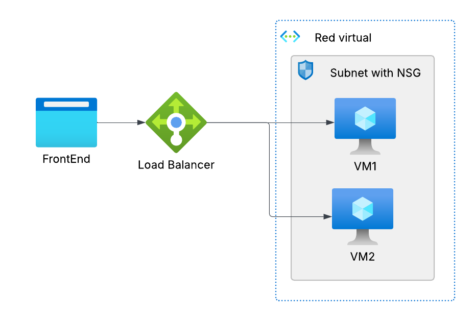